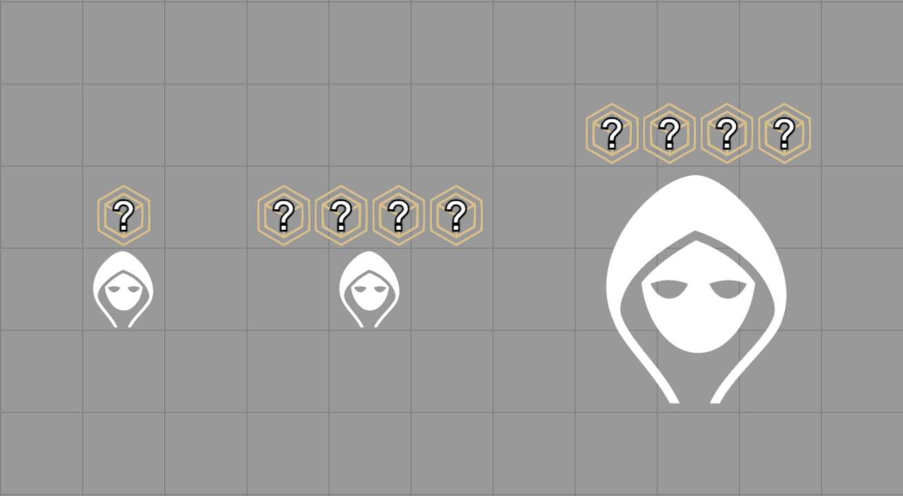
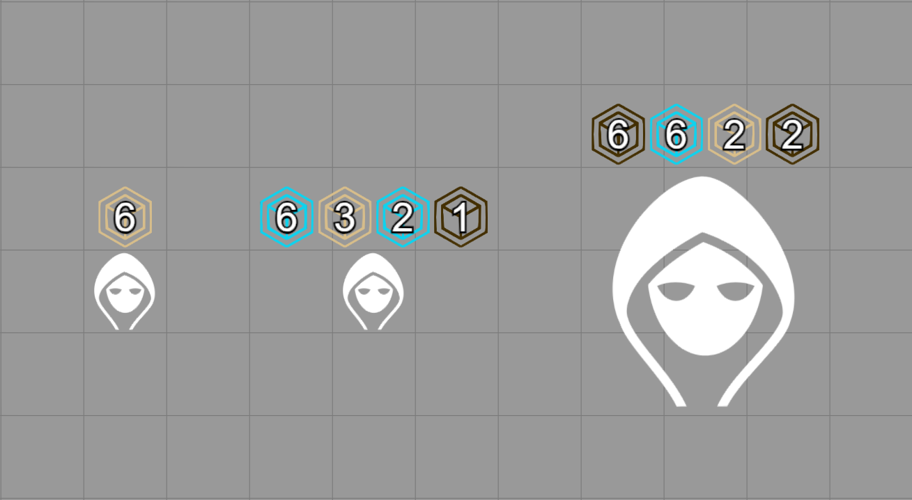

# Stars Initiative Overlay

**Manifest URL:** `https://raw.githubusercontent.com/VaniFoundry/stars-initiative-overlay/main/module.json`

**Designed with [Stars of the City](https://github.com/tsu-b-asa/sotc) in mind** - a Project Moon inspired TTRPG by Jakkafang & community.

A Foundry VTT module that adds visual initiative dice markers above tokens during combat.

## Features

- **Initiative Dice Display**: Shows initiative values above tokens in combat, with one marker per speed die

- **Three-State Indicators**: Click dice to cycle through three visual states 

    - ***Yellow/DiceSlotIcon***: Unused speed dice
    - ***Brown/DiceSlotIcon2***: Already used speed dice
    - ***Blue/DiceSlotIcon3***: Defensive dice reminder

        > Note: If a colorblind mode is not an option at the moment you can swap de resources in the `img` file to your liking

- **Automatic Reset**: All dice reset to the default state at the start of each new round
- **Combat Integration**: Markers appear automatically when combat starts and disappear when it ends
- **Multiplayer Sync**: Dice states are synchronized across all connected clients

## How It Works

When a token enters combat, the module displays dice markers above it based on the actor's `speed_dice.num_dice` property. Each marker shows either:
- The combatant's initiative/speed dice value (if rolled)
- "?" if initiative hasn't been rolled yet

### Cycling Dice States

Click any dice marker to cycle through the three visual states.
Everyone have default permission to interact with every dice.
States persist throughout the round and reset automatically when a new round begins.

## Installation

1. Place the module folder in your Foundry `Data/modules` directory
2. Ensure the following images exist in `modules/stars-initiative-overlay/img/`:
   - `DiceSlotIcon.webp`
   - `DiceSlotIcon2.webp`
   - `DiceSlotIcon3.webp`
3. Enable the module in Foundry's module management screen

Or install directly via Foundry using the [manifest URL](https://raw.githubusercontent.com/VaniFoundry/stars-initiative-overlay/main/module.json).

## Compatibility

| Foundry Version | Status |
|---|---|
| v13 | ✅ Verified |
| v11 | ✅ Supported |

## Changelog

NOTE: Will be edited after v1.1.0 for major changes or updates